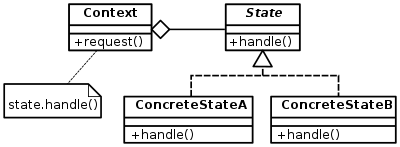

# 6.0 - State Machine 🕹️

---

__Reference [HERE](https://github.com/ianrufus/youtube/tree/main/pygame-state)__

A game can be thought as a state machine. Even a basic game may consist of states like `Main Menu`, 
`In Game`, `Splash Screen`, `Game Over` etc, and coding a game without using State Machines may be challenging, and ending up creating spaghetti code.

The idea of __State__ design pattern is to break down the logic of the game into several States, then access them under
a unified interface like `draw()`, `update()`, `handle_event()` etc.

Using this pattern, our game will consist a top level __State Machine__ which at a particular time, will consist only a
single state. That state will know what to do by itself when methods like `draw()`, `update()` and `handle_event()` is
called.

Also, a single __State__ is not fixed. It may return some state transition input back to the __State Machine__ to indicate
that transitioning to another state is required. For example, the game is in `In Game` state yet the HP of character falls
below 0, then the state shall indicate the State Machine that it's time to transition to `Game Over` state, and possibly
passing the required information to the transitioned state.

  

---

## Food For Thought 🧠

* Instead of the State Machine having to call the state's `update()`, `handle_input()` and `render()` etc, another
potential design choice is to just call the state's `run()` method, which it will internally handle the game loop. Of course,
  the loop doesn't run infinitely and will stop once a state transition needs to occur.
  

* State Machine isn't only bound to the top level State Machine! Internally, the states themselves can as well as be State
Machine themselves. For example, in the `In Game` state, it may sub-branch into states like `Playing`, `Paused`, `Loading` etc.
  For example, the `Paused` screen will still show the avatar and the world, only with a "Paused" text overlay.
  In this case, the avatar information may be inside `In Game` state, and making them accessible to top level state machine
  may prove to be tedious. Instead, having sub-states in states may be more efficient (and make sense).