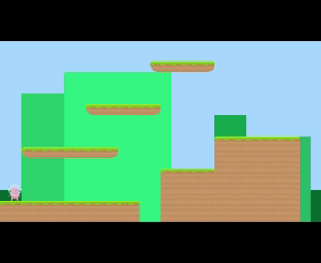

# Introduction to Game Development - Tutorial

Following this tutorial, one will be exposed to basic game development concepts and techniques using __Python's__
`pygame` module

Created by __AdmiJW__, with main references going to:

* [Official Pygame documentation](https://www.pygame.org/docs)
* [DaFluffyPotato's Pygame Series](https://www.youtube.com/c/DaFluffyPotato)