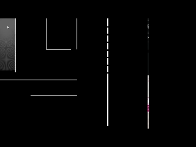

# Introduction to Game Development - Tutorial

Following this tutorial, one will be exposed to basic game development concepts and techniques using __Python's__
`pygame` module

Created by __AdmiJW__, with main references going to:

* [Official Pygame documentation](https://www.pygame.org/docs)
* [DaFluffyPotato's Pygame Series](https://www.youtube.com/c/DaFluffyPotato)

## Chapters:

| Chapter | Description |
|-|-|
| __1__ | Boilerplate code you have to write in order to get started with `pygame` |
| __2__ | Basic Rendering - Image, Text, Shape |
| __3__ | Input, Movement, Collision, Boundary Checking. Dirty Rects |
| __4__ | Screen size and resolution, Framerate Independence |
| __5__ | State Machine (Directory) |
| __6__ | 2D game basics - Tiles, Ramps |
| __7__ | Camera and Parallax Scrolling |
| __8__ | Animation and Particle System |
| __9__ | 2D World Generation - Infinite World, Chunks |
| __10__ | Sounds and Musics |
| __11__ | Porting your `pygame` project |
| __12__ | Lighting |